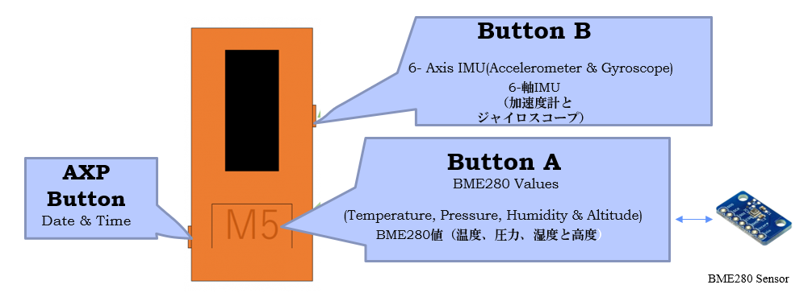

Implementation of Button Press function. There are total 3 buttons on the M5StickC development board. This program implements different features on each button press.

**Used Modules**
- M5StickC IOT Development Board
- BME280 Temperature, Humidity and Pressure Sensor
- Internal 6-Axis IMU of M5StickC (Acceleration and Gyroscope)
- Date & Time from RTC Module (inside M5StickC) and NTP Server.

**Features**
- I2C Connection with BME280.
- Different Feature on each button press.
- Menu is displayed at first.
- If the home button (Button A), big button on the middle is pressed then tmeperature, pressure and humidity values are displayed. The values are fetched from the BME280 sensor.
- If the Button B (On the right side middle) is pressed then acceleration and gyroscope values are displayed.
- Pressing the power button on the left down side shows you current date and time.

